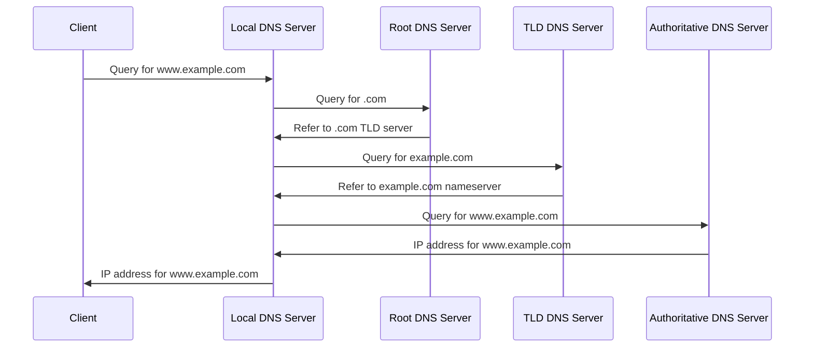

🚀 **Mastering IP and iptables in Linux: A Comprehensive Guide** 🚀

## Author: Samir Rizk
## Date: 26/08/2024
## Copyright: 2024 Samir Rizk. All rights reserved.

---

# Understanding IP and iptables in Linux

1. Introduction to IP (Internet Protocol)
   - What is IP?
   - IPv4 vs IPv6
   - IP addressing basics

2. Networking Fundamentals
   - Subnets and netmasks
   - Default gateways
   - DNS (Domain Name System)

3. Linux Networking Commands
   - ifconfig / ip
   - route
   - netstat / ss

4. Introduction to iptables
   - What is iptables?
   - Why use iptables?

5. iptables Concepts
   - Tables (filter, nat, mangle, raw)
   - Chains (INPUT, OUTPUT, FORWARD, etc.)
   - Rules and targets

6. Basic iptables Commands
   - Listing rules
   - Adding and deleting rules
   - Setting default policies

7. Writing iptables Rules
   - Syntax and structure
   - Matching criteria (protocols, ports, addresses)
   - Actions (ACCEPT, DROP, REJECT)

8. Advanced iptables Techniques
   - State tracking
   - NAT (Network Address Translation)
   - Port forwarding

9. Building a Basic Firewall
   - Step-by-step example
   - Best practices

10. Saving and Restoring iptables Rules
    - iptables-save and iptables-restore

11. Troubleshooting and Debugging
    - Common issues and solutions
    - Logging and analysis
---

# 1. Introduction to IP (Internet Protocol)

## a) What is IP?

IP, or Internet Protocol, is a fundamental protocol in computer networking that enables communication between devices across networks. It's responsible for addressing and routing data packets between source and destination devices.

Key points about IP:

- Operates at the network layer (Layer 3) of the OSI model
- Provides a standardized way for devices to send and receive data over the internet or any IP-based network
- Connectionless: doesn't establish a dedicated connection before sending data
- Packet-switched: breaks data into smaller packets for efficient transmission
- Provides addressing mechanisms to identify devices on a network
- Handles routing of data packets across multiple networks

## b) IPv4 vs IPv6

IPv4 (Internet Protocol version 4) and IPv6 (Internet Protocol version 6) are two versions of the Internet Protocol. The main difference is in their addressing capabilities and some additional features.

### IPv4:

- Uses 32-bit addresses (e.g., 192.168.1.1)
- Can support approximately 4.3 billion unique addresses
- Widely deployed and still the most common version
- Uses dot-decimal notation (four groups of numbers separated by dots)

### IPv6:

- Uses 128-bit addresses (e.g., 2001:0db8:85a3:0000:0000:8a2e:0370:7334)
- Can support approximately 340 undecillion (3.4 × 10^38) unique addresses
- Designed to address IPv4 address exhaustion
- Uses hexadecimal notation (eight groups of four hexadecimal digits separated by colons)
- Includes built-in support for IPsec, improved QoS, and simplified header structure

## c) IP addressing basics

IP addresses are unique identifiers assigned to devices on a network. They serve two main purposes: host or network interface identification and location addressing.

Key concepts in IP addressing:

- **Network portion**: Identifies the network to which a device belongs
- **Host portion**: Identifies the specific device within that network
- **Subnet mask**: Determines which part of an IP address belongs to the network and which to the host
- **CIDR notation**: A compact way to specify IP addresses and their associated routing prefix (e.g., 192.168.1.0/24)
- **Public vs. Private IP addresses**: Public IPs are globally unique and routable on the internet, while private IPs are used within local networks
- **Special addresses**: Loopback (127.0.0.1), broadcast (255.255.255.255), and others
---


# 2. Networking Fundamentals

## a) Subnets and Netmasks

A subnet is a logical subdivision of an IP network. Subnetting allows for more efficient use of IP addresses and improved network performance.

### Netmask

A netmask is used to define the network and host portions of an IP address. It's typically represented in one of two ways:

1. Dotted decimal notation (e.g., 255.255.255.0)
2. CIDR notation (e.g., /24)

#### Netmask Example:

```
IP Address:  192.168.1.100
Netmask:     255.255.255.0  (/24 in CIDR)

Network:     11000000.10101000.00000001.00000000
Host:        00000000.00000000.00000000.01100100
```

### Subnetting Visual Representation:

```
   Network Address     Subnet Mask      Usable IP Range
+------------------+------------------+------------------+
| 192.168.1.0      | 255.255.255.0    | 192.168.1.1      |
|                  | (/24)            |        to        |
|                  |                  | 192.168.1.254    |
+------------------+------------------+------------------+
```

## b) Default Gateways

A default gateway is the node in a computer network that serves as the forwarding host (router) to other networks when no other route specification matches the destination IP address of a packet.

### Default Gateway in Network Architecture:

```
+-------------+     +-------------+     +-------------+
|   Device    |     |   Router    |     |  Internet   |
|  (Local IP) | --> | (Gateway IP)| --> |             |
+-------------+     +-------------+     +-------------+
 192.168.1.100      192.168.1.1         Various IPs
```

Key points:
- The default gateway is typically the router's IP address on the local network.
- It's the exit point for all traffic destined for other networks.
- In most home or small office networks, it's usually the last number in the IP address (e.g., 192.168.1.1 or 10.0.0.1).

## c) DNS (Domain Name System)

DNS is a hierarchical and decentralized naming system for computers, services, or other resources connected to the Internet or a private network.

### DNS Resolution Process:



Key DNS concepts:
1. **DNS Records**: Different types of records store various information
   - A (Address) Record: Maps a domain to an IPv4 address
   - AAAA Record: Maps a domain to an IPv6 address
   - CNAME (Canonical Name): Creates an alias for another domain
   - MX (Mail Exchanger): Specifies mail servers for the domain
   - TXT (Text): Stores text information, often used for verification

2. **DNS Caching**: To improve performance, DNS results are cached at various levels
   - Browser cache
   - Operating system cache
   - ISP's DNS server cache

3. **DNS Security**:
   - DNSSEC (Domain Name System Security Extensions): Adds cryptographic signatures to DNS records to prevent tampering
   - DNS over HTTPS (DoH) and DNS over TLS (DoT): Encrypt DNS queries for privacy
---

# 3. Linux Networking Commands (Extended)

## a) ip

The `ip` command is crucial for firewall configuration as it allows you to view and manipulate network interfaces, IP addresses, and routing tables.

### Viewing Network Interfaces

```bash
ip link show
```

This command displays all network interfaces, including their state (UP/DOWN) and MAC addresses. When configuring a firewall, you need to know which interfaces to protect.

### IP Address Management

```bash
ip addr show
ip addr add 192.168.1.10/24 dev eth0
ip addr del 192.168.1.10/24 dev eth0
```

These commands are useful for viewing, adding, or removing IP addresses. When setting up a firewall, you need to know the IP addresses assigned to your interfaces to create appropriate rules.

### Routing Table Management

```bash
ip route show
ip route add 10.0.0.0/8 via 192.168.1.1
ip route del 10.0.0.0/8
```

Understanding and manipulating the routing table is crucial for firewall setup, especially for controlling which traffic is forwarded between interfaces.

### ARP Cache Management

```bash
ip neigh show
```

This command displays the ARP (Address Resolution Protocol) cache, which can be useful for identifying devices on your local network and potentially detecting ARP spoofing attacks.

## b) ss

The `ss` command is particularly useful for firewall management as it allows you to monitor network connections in real-time.

### Viewing Established Connections

```bash
ss -tupn
```

This command shows all established TCP and UDP connections with numeric addresses and port numbers, along with the associated processes. It's invaluable for identifying which applications are making network connections.

### Monitoring Listening Ports

```bash
ss -tlnp
```

This command displays all TCP listening sockets, which is crucial for understanding which services are accessible on your system.

### Connection States

```bash
ss -s
```

This provides a summary of socket statistics, including the number of connections in various states (established, time-wait, etc.). This information can help you tune your firewall rules and system parameters.

### Filtering Connections

```bash
ss dst 192.168.1.100
ss sport = :80
```

These commands filter connections based on destination IP or source port, which can be helpful when troubleshooting firewall rules.

## c) tcpdump

While not mentioned in the original outline, `tcpdump` is an essential tool for packet analysis, which is crucial when setting up and troubleshooting firewalls.

Basic usage:
```bash
tcpdump -i eth0 -n
```

This captures packets on the eth0 interface and displays them in a readable format.

Filtering traffic:
```bash
tcpdump -i eth0 -n 'tcp port 80'
tcpdump -i eth0 -n 'src 192.168.1.100'
```

These commands filter traffic based on port or IP address, which is extremely useful when verifying firewall rules.

Saving captures:
```bash
tcpdump -i eth0 -w capture.pcap
```

This saves the captured packets to a file for later analysis, which can be invaluable when debugging complex firewall issues.

## d) netcat (nc)

Netcat is often called the "Swiss Army knife" of networking tools. It's useful for testing network connections and can help verify firewall rules.

Testing open ports:
```bash
nc -zv 192.168.1.100 22
```

This attempts to connect to port 22 on the specified IP address, which can help verify if your firewall is correctly blocking or allowing traffic.

Listening on a port:
```bash
nc -l -p 8080
```

This sets up a simple listener on port 8080, which can be useful for testing outbound connection rules.

## e) nmap

While not a standard Linux command, nmap is an essential tool for network exploration and security auditing, which is crucial when setting up a firewall.

Basic scan:
```bash
nmap 192.168.1.100
```

This scans the most common 1000 ports on the specified IP address.

Comprehensive scan:
```bash
nmap -p- -sV -sC 192.168.1.100
```

This scans all ports, determines service/version info, and runs default nmap scripts, providing a comprehensive view of open services.

## Firewall Relevance

When building a firewall with iptables, these commands are essential for:

1. **Interface Configuration**: Use `ip` to ensure your network interfaces are correctly configured.

2. **Connection Monitoring**: Use `ss` to monitor active connections and open ports, helping you craft appropriate firewall rules.

3. **Packet Analysis**: Use `tcpdump` to capture and analyze traffic, verifying that your firewall rules are working as intended.

4. **Rule Testing**: Use `netcat` and `nmap` to test your firewall rules by attempting connections from various sources to different ports.

5. **Troubleshooting**: All of these tools are invaluable for troubleshooting issues with your firewall configuration.
---

# 4. Introduction to iptables

## a) What is iptables?

iptables is a user-space utility program that allows a system administrator to configure the IP packet filter rules of the Linux kernel firewall, implemented as different Netfilter modules. The filters are organized in different tables, which contain chains of rules for how to treat network traffic packets.

### Key characteristics:

1. **Kernel-level firewall**: iptables interfaces with the kernel's Netfilter framework, providing high-performance packet filtering.
2. **Stateful inspection**: Can track the state of network connections traversing the firewall.
3. **IPv4 and IPv6 support**: iptables is for IPv4, while ip6tables is its IPv6 counterpart.
4. **Extensible**: Supports custom modules for advanced packet manipulation and filtering.

## b) Why use iptables?

1. **Fine-grained control**: Allows precise control over incoming and outgoing network traffic.
2. **Performance**: As a kernel-level firewall, it provides high-speed packet processing.
3. **Flexibility**: Can be used for simple port filtering or complex network address translation (NAT) setups.
4. **Logging capabilities**: Offers detailed logging of network traffic for security analysis.
5. **Scripting support**: Rules can be easily automated and managed through shell scripts.

## c) iptables Architecture

### Tables

iptables organizes its rules into tables, each serving a specific purpose:

1. **filter**: The default table, used for packet filtering.
2. **nat**: Used for Network Address Translation.
3. **mangle**: Used for specialized packet alteration.
4. **raw**: Used for configuring exemptions from connection tracking.
5. **security**: Used for Mandatory Access Control networking rules.

### Chains

Within each table, rules are further organized into chains. The built-in chains are:

1. **INPUT**: For packets destined to local sockets.
2. **FORWARD**: For packets being routed through the system.
3. **OUTPUT**: For locally-generated packets.
4. **PREROUTING**: For altering packets as soon as they come in.
5. **POSTROUTING**: For altering packets as they are about to go out.

Not all chains exist in all tables. Here's a breakdown:

| Table    | Chains                                     |
|----------|-------------------------------------------|
| filter   | INPUT, FORWARD, OUTPUT                     |
| nat      | PREROUTING, OUTPUT, POSTROUTING            |
| mangle   | PREROUTING, INPUT, FORWARD, OUTPUT, POSTROUTING |
| raw      | PREROUTING, OUTPUT                         |
| security | INPUT, FORWARD, OUTPUT                     |

### Rules

Rules are the individual instructions within each chain that specify what to do with a packet. Each rule consists of a matching criteria and an action (target).

## d) Packet Flow Through iptables

Understanding how packets flow through iptables is crucial for effective firewall configuration:

```
                               ROUTING
                                 |
                                 v
 --->  [PREROUTING] ---> [FORWARD] -----> [POSTROUTING] --->
          ^                 ^                   ^
          |                 |                   |
       Incoming          Forwarded           Outgoing
        Packets           Packets             Packets
          |                                     |
          v                                     v
      [INPUT]                               [OUTPUT]
          |                                     ^
          |                                     |
          v                                     |
    Local Process                         Local Process
```

1. Incoming packets first hit the PREROUTING chain.
2. Packets destined for the local system go through the INPUT chain.
3. Packets to be forwarded go through the FORWARD chain.
4. Locally generated packets go through the OUTPUT chain.
5. All outgoing packets pass through the POSTROUTING chain.

## e) Basic iptables Commands

### Viewing current rules

```bash
iptables -L -v
```

This lists all rules in the filter table with verbose output.

```bash
iptables -t nat -L -v
```

This lists rules in the NAT table.

### Adding a rule

```bash
iptables -A INPUT -p tcp --dport 22 -j ACCEPT
```

This appends (-A) a rule to the INPUT chain to accept (-j ACCEPT) TCP packets (-p tcp) destined for port 22 (--dport 22).

### Deleting a rule

```bash
iptables -D INPUT 1
```

This deletes the first rule in the INPUT chain.

### Setting the default policy

```bash
iptables -P INPUT DROP
```

This sets the default policy for the INPUT chain to DROP.

### Saving rules

```bash
iptables-save > /etc/iptables/rules.v4
```

This saves the current iptables configuration to a file.

### Restoring rules

```bash
iptables-restore < /etc/iptables/rules.v4
```

This restores iptables rules from a file.

## f) iptables Rule Syntax

The general syntax for an iptables rule is:

```
iptables [-t table] command chain rules
```

Where:
- `table` is one of the iptables tables (filter, nat, mangle, raw, security)
- `command` is the action to perform (e.g., -A to append, -D to delete)
- `chain` is the chain to operate on (e.g., INPUT, OUTPUT, FORWARD)
- `rules` are the matching criteria and target

Example:

```bash
iptables -A INPUT -p tcp --dport 80 -s 192.168.1.0/24 -j ACCEPT
```

This rule:
- Appends (-A) to the INPUT chain
- Matches TCP protocol (-p tcp)
- Matches destination port 80 (--dport 80)
- Matches source IP range 192.168.1.0/24 (-s 192.168.1.0/24)
- Sets the target to ACCEPT (-j ACCEPT)

## g) Connection Tracking

iptables uses connection tracking to maintain state information about network connections. This allows for stateful filtering, where decisions can be made based on the connection state.

Common states:
- NEW: The first packet of a connection
- ESTABLISHED: Part of an established connection
- RELATED: Related to an established connection (e.g., FTP data connection)
- INVALID: Packets that don't match known states

Example usage:

```bash
iptables -A INPUT -m state --state ESTABLISHED,RELATED -j ACCEPT
```

This rule accepts all packets that are part of established connections or related to them.

---

# 5. iptables Concepts

## a) Tables in Detail

iptables uses different tables to organize rules based on their purpose. Each table contains specific chains and is processed in a particular order.

### 1. filter Table

The filter table is the default and most commonly used table. It's responsible for packet filtering.

Chains in the filter table:
- INPUT
- FORWARD
- OUTPUT

Use cases:
- Blocking specific IP addresses or ports
- Allowing or denying traffic based on protocol
- Implementing basic firewall policies

Example:
```bash
iptables -t filter -A INPUT -p tcp --dport 22 -j ACCEPT
```

### 2. nat Table

The nat (Network Address Translation) table is used for modifying source or destination addresses of packets.

Chains in the nat table:
- PREROUTING
- INPUT (rarely used)
- OUTPUT
- POSTROUTING

Use cases:
- Port forwarding
- Masquerading (hiding a private network behind a public IP)
- Redirecting traffic

Example (Port Forwarding):
```bash
iptables -t nat -A PREROUTING -p tcp --dport 80 -j REDIRECT --to-port 8080
```

### 3. mangle Table

The mangle table is used for specialized packet alteration.

Chains in the mangle table:
- PREROUTING
- INPUT
- FORWARD
- OUTPUT
- POSTROUTING

Use cases:
- Modifying packet TTL (Time To Live)
- Adding custom marks to packets
- Altering TOS (Type of Service) field

Example (Marking Packets):
```bash
iptables -t mangle -A PREROUTING -p tcp --dport 80 -j MARK --set-mark 1
```

### 4. raw Table

The raw table is used for configuring exemptions from connection tracking.

Chains in the raw table:
- PREROUTING
- OUTPUT

Use cases:
- Disabling connection tracking for specific traffic
- Improving performance for certain types of traffic

Example (Disable Tracking for DNS):
```bash
iptables -t raw -A OUTPUT -p udp --dport 53 -j NOTRACK
```

### 5. security Table

The security table is used for Mandatory Access Control networking rules.

Chains in the security table:
- INPUT
- FORWARD
- OUTPUT

Use cases:
- Implementing SELinux policies
- Adding security context marks to packets

Example (Setting SELinux Context):
```bash
iptables -t security -A INPUT -p tcp --dport 80 -j SECMARK --selctx system_u:object_r:http_server_packet_t:s0
```

## b) Chains in Depth

Chains are lists of rules that are processed in order. There are built-in chains and user-defined chains.

### Built-in Chains

1. **INPUT**: For packets destined to local sockets
2. **FORWARD**: For packets being routed through the box
3. **OUTPUT**: For locally-generated packets
4. **PREROUTING**: For altering packets as soon as they come in
5. **POSTROUTING**: For altering packets as they are about to go out

### User-Defined Chains

You can create custom chains to organize your rules more efficiently:

```bash
iptables -N MY_CUSTOM_CHAIN
iptables -A INPUT -p tcp --dport 80 -j MY_CUSTOM_CHAIN
iptables -A MY_CUSTOM_CHAIN -s 192.168.1.0/24 -j ACCEPT
iptables -A MY_CUSTOM_CHAIN -j DROP
```

This creates a custom chain for handling HTTP traffic, allowing connections from a specific subnet and dropping all others.

## c) Rules and Targets

Rules are the core of iptables functionality. Each rule consists of matching criteria and a target (action).

### Matching Criteria

- Protocol (-p): tcp, udp, icmp, etc.
- Source/Destination IP (-s, -d)
- Source/Destination Port (--sport, --dport)
- Input/Output interface (-i, -o)
- TCP flags (--tcp-flags)
- Connection state (-m state --state)

### Common Targets

1. **ACCEPT**: Allow the packet
2. **DROP**: Silently discard the packet
3. **REJECT**: Discard the packet and send an error message
4. **LOG**: Log the packet details
5. **RETURN**: Return to the calling chain
6. **REDIRECT**: Redirect the packet to another port
7. **MASQUERADE**: Special form of NAT used for dynamic IP addresses

Example of a complex rule:
```bash
iptables -A INPUT -p tcp -m multiport --dports 80,443 -m state --state NEW,ESTABLISHED -j ACCEPT
```
This rule accepts new and established TCP connections to ports 80 and 443.

## d) Rule Ordering and Processing

Rules within a chain are processed in order. The first matching rule's target is applied, and processing usually stops there (unless the target specifies otherwise).

Example of rule ordering:
```bash
iptables -A INPUT -p tcp --dport 22 -j ACCEPT
iptables -A INPUT -p tcp --dport 80 -j ACCEPT
iptables -A INPUT -j DROP
```
This allows SSH and HTTP traffic but drops all other incoming traffic.

## e) Connection Tracking (conntrack)

Connection tracking is a core feature of iptables that allows for stateful filtering. It keeps track of all connections passing through the firewall.

States:
- NEW: First packet of a connection
- ESTABLISHED: Part of an existing connection
- RELATED: Related to an existing connection
- INVALID: Could not be identified or doesn't belong to any connection

Example of using connection tracking:
```bash
iptables -A INPUT -m state --state RELATED,ESTABLISHED -j ACCEPT
iptables -A INPUT -p tcp --dport 22 -m state --state NEW -j ACCEPT
```
This allows established connections and new SSH connections.

## f) NAT (Network Address Translation)

NAT is used to modify source or destination addresses of packets. There are several types of NAT:

1. **SNAT (Source NAT)**: Modifies the source address of packets, typically used for internet access sharing.
   ```bash
   iptables -t nat -A POSTROUTING -o eth0 -j MASQUERADE
   ```

2. **DNAT (Destination NAT)**: Modifies the destination address of packets, used for port forwarding.
   ```bash
   iptables -t nat -A PREROUTING -i eth0 -p tcp --dport 80 -j DNAT --to-destination 192.168.1.100:8080
   ```

3. **MASQUERADE**: A special form of SNAT used when the outgoing IP address is dynamic.
   ```bash
   iptables -t nat -A POSTROUTING -o ppp0 -j MASQUERADE
   ```

## g) Logging and Debugging

iptables provides logging capabilities which are crucial for debugging and security monitoring:

```bash
iptables -A INPUT -p tcp --dport 80 -j LOG --log-prefix "HTTP Request: "
```

This logs all incoming HTTP requests before any other rules are applied.

You can view these logs typically in `/var/log/messages` or `/var/log/syslog`.

## h) Performance Considerations

1. Use connection tracking wisely, as it can consume memory.
2. Place the most frequently matched rules at the top of chains.
3. Use custom chains to organize complex rulesets.
4. Use the `RETURN` target to optimize processing in custom chains.
---

# 6. Basic iptables Commands

This section covers the fundamental iptables commands that are essential for managing your firewall. We'll explore each command in detail, providing syntax, examples, and best practices.

## a) Listing Rules

The most basic and frequently used command is for listing existing rules.

### Syntax:
```bash
iptables [-t table] -L [chain] [options]
```

### Common Options:
- `-v`: Verbose output
- `-n`: Numeric output (IP addresses and port numbers)
- `-x`: Exact numbers (no rounding)
- `--line-numbers`: Show line numbers for each rule

### Examples:

1. List all rules in the filter table:
   ```bash
   iptables -L
   ```

2. List rules in the NAT table with verbose output:
   ```bash
   iptables -t nat -L -v
   ```

3. List INPUT chain rules with line numbers and numeric output:
   ```bash
   iptables -L INPUT -v -n --line-numbers
   ```

### Practical Application:
Regularly list your rules to audit your firewall configuration. This helps in identifying any unauthorized changes or misconfigurations.

## b) Adding Rules

Adding rules is crucial for building your firewall policy.

### Syntax:
```bash
iptables [-t table] -A chain rule-specification
```

- `-A`: Append rule to the end of the chain
- `-I`: Insert rule at a specific position in the chain

### Examples:

1. Allow incoming SSH connections:
   ```bash
   iptables -A INPUT -p tcp --dport 22 -j ACCEPT
   ```

2. Drop all traffic from a specific IP:
   ```bash
   iptables -A INPUT -s 192.168.1.100 -j DROP
   ```

3. Allow established and related connections:
   ```bash
   iptables -A INPUT -m conntrack --ctstate ESTABLISHED,RELATED -j ACCEPT
   ```

4. Insert a rule at the beginning of the INPUT chain:
   ```bash
   iptables -I INPUT 1 -p tcp --dport 80 -j ACCEPT
   ```

### Practical Application:
When adding rules, consider the order. More specific rules should generally come before more general ones. For instance, allow rules for specific services before a general "deny all" rule.

## c) Deleting Rules

Removing unnecessary or incorrect rules is as important as adding them.

### Syntax:
```bash
iptables [-t table] -D chain rule-specification
iptables [-t table] -D chain rulenum
```

### Examples:

1. Delete a specific rule:
   ```bash
   iptables -D INPUT -p tcp --dport 80 -j ACCEPT
   ```

2. Delete the third rule in the INPUT chain:
   ```bash
   iptables -D INPUT 3
   ```

3. Delete all rules in a chain:
   ```bash
   iptables -F INPUT
   ```

### Practical Application:
Before deleting rules, always list them first to ensure you're removing the correct one. Consider using the `--line-numbers` option when listing to easily identify rules by their position.

## d) Replacing Rules

Modifying existing rules without changing their position in the chain.

### Syntax:
```bash
iptables [-t table] -R chain rulenum new-rule
```

### Example:
Replace the first rule in the INPUT chain:
```bash
iptables -R INPUT 1 -p tcp --dport 22 -j DROP
```

### Practical Application:
Use replace when you want to modify a rule's behavior without changing its position, which can be crucial in maintaining the logic of your ruleset.

## e) Setting Default Policies

Default policies determine what happens to packets that don't match any rules in a chain.

### Syntax:
```bash
iptables [-t table] -P chain target
```

### Examples:

1. Set default policy for INPUT chain to DROP:
   ```bash
   iptables -P INPUT DROP
   ```

2. Set default policy for OUTPUT chain to ACCEPT:
   ```bash
   iptables -P OUTPUT ACCEPT
   ```

### Practical Application:
A common security practice is to set the default policies to DROP for INPUT and FORWARD chains, and ACCEPT for OUTPUT. This creates a "deny by default" firewall where you explicitly allow only necessary traffic.

## f) Creating and Managing Custom Chains

Custom chains help in organizing complex rulesets.

### Creating a new chain:
```bash
iptables -N CUSTOM_CHAIN
```

### Adding rules to custom chain:
```bash
iptables -A CUSTOM_CHAIN -p tcp --dport 80 -j ACCEPT
```

### Linking custom chain to built-in chain:
```bash
iptables -A INPUT -p tcp -j CUSTOM_CHAIN
```

### Deleting a custom chain:
```bash
iptables -X CUSTOM_CHAIN
```

### Practical Application:
Use custom chains to group related rules. For example, create a "WEB_TRAFFIC" chain for all web-related rules, making your main chains more manageable.

## g) Saving and Restoring Rules

iptables rules are not persistent by default. You need to save them to make them survive reboots.

### Saving rules:
```bash
iptables-save > /etc/iptables/rules.v4
```

### Restoring rules:
```bash
iptables-restore < /etc/iptables/rules.v4
```

### Practical Application:
Always save your rules after making changes. Consider creating a script that loads your saved rules on system startup.

## h) Flushing Rules

Clearing all rules or rules in a specific chain.

### Flush all rules:
```bash
iptables -F
```

### Flush rules in a specific chain:
```bash
iptables -F INPUT
```

### Practical Application:
Be cautious when flushing rules, especially remotely. Always ensure you have a way to regain access (like a persistent SSH rule) before flushing.

## i) Logging

Logging is crucial for debugging and security monitoring.

### Adding a logging rule:
```bash
iptables -A INPUT -p tcp --dport 80 -j LOG --log-prefix "HTTP Request: "
```

### Practical Application:
Place logging rules before DROP or REJECT rules to capture information about blocked traffic. Use unique log prefixes to easily identify different types of logged traffic.

## j) Advanced Command Examples

1. Allow incoming traffic on multiple ports:
   ```bash
   iptables -A INPUT -p tcp -m multiport --dports 80,443,8080 -j ACCEPT
   ```

2. Limit the rate of incoming SSH connections:
   ```bash
   iptables -A INPUT -p tcp --dport 22 -m state --state NEW -m recent --set
   iptables -A INPUT -p tcp --dport 22 -m state --state NEW -m recent --update --seconds 60 --hitcount 4 -j DROP
   ```

3. NAT for a specific IP range:
   ```bash
   iptables -t nat -A POSTROUTING -s 192.168.1.0/24 -o eth0 -j MASQUERADE
   ```

4. Port forwarding:
   ```bash
   iptables -t nat -A PREROUTING -i eth0 -p tcp --dport 80 -j DNAT --to-destination 192.168.1.100:8080
   ```
   ---

   # 7. Writing iptables Rules

Writing effective iptables rules is crucial for creating a robust and secure firewall. This section will cover the syntax, structure, and best practices for crafting iptables rules.

## a) Rule Syntax and Structure

An iptables rule follows this general structure:

```
iptables [-t table] command chain [match options] [jump options]
```

### Components Breakdown:

1. **Table (-t)**: Specifies the table (filter, nat, mangle, raw). If omitted, the filter table is used by default.

2. **Command**: Specifies the action to take (e.g., -A to append, -I to insert, -D to delete).

3. **Chain**: Specifies the chain to operate on (e.g., INPUT, OUTPUT, FORWARD).

4. **Match Options**: Criteria for matching packets (e.g., protocol, port, source/destination IP).

5. **Jump Options**: Specifies the target or action to take if the packet matches the criteria.

### Example:
```bash
iptables -A INPUT -p tcp --dport 80 -s 192.168.1.0/24 -j ACCEPT
```

This rule:
- Appends (-A) to the INPUT chain
- Matches TCP protocol (-p tcp)
- Matches destination port 80 (--dport 80)
- Matches source IP range 192.168.1.0/24 (-s 192.168.1.0/24)
- Jumps to ACCEPT target if all criteria are met (-j ACCEPT)

## b) Matching Criteria

iptables offers a wide range of matching options to precisely target specific types of traffic.

### 1. Protocol Matching
```bash
iptables -A INPUT -p tcp
iptables -A INPUT -p udp
iptables -A INPUT -p icmp
```

### 2. Port Matching
```bash
iptables -A INPUT -p tcp --dport 80
iptables -A INPUT -p tcp --sport 1024:65535
iptables -A INPUT -p tcp -m multiport --dports 80,443,8080
```

### 3. IP Address Matching
```bash
iptables -A INPUT -s 192.168.1.100
iptables -A INPUT -d 10.0.0.0/8
```

### 4. Interface Matching
```bash
iptables -A INPUT -i eth0
iptables -A OUTPUT -o eth1
```

### 5. State Matching
```bash
iptables -A INPUT -m state --state NEW,ESTABLISHED
```

### 6. TCP Flags Matching
```bash
iptables -A INPUT -p tcp --tcp-flags ALL SYN,ACK
```

### 7. Limit Matching
```bash
iptables -A INPUT -p icmp --icmp-type echo-request -m limit --limit 1/second
```

### 8. String Matching
```bash
iptables -A INPUT -p tcp --dport 80 -m string --string "GET /admin" --algo bm -j DROP
```

## c) Actions (Targets)

After matching a packet, iptables needs to know what to do with it. This is specified by the target.

### Common Targets:

1. **ACCEPT**: Allow the packet to pass.
   ```bash
   iptables -A INPUT -p tcp --dport 22 -j ACCEPT
   ```

2. **DROP**: Silently discard the packet.
   ```bash
   iptables -A INPUT -s 10.0.0.0/8 -j DROP
   ```

3. **REJECT**: Discard the packet and send an error message.
   ```bash
   iptables -A INPUT -p tcp --dport 80 -j REJECT --reject-with tcp-reset
   ```

4. **LOG**: Log the packet details and continue processing.
   ```bash
   iptables -A INPUT -p tcp --dport 22 -j LOG --log-prefix "SSH Access: "
   ```

5. **RETURN**: Return to the calling chain.
   ```bash
   iptables -A CUSTOM_CHAIN -p tcp --dport 80 -j RETURN
   ```

6. **DNAT** (Destination NAT): Modify the destination address of the packet.
   ```bash
   iptables -t nat -A PREROUTING -p tcp --dport 80 -j DNAT --to-destination 192.168.1.100:8080
   ```

7. **SNAT** (Source NAT): Modify the source address of the packet.
   ```bash
   iptables -t nat -A POSTROUTING -o eth0 -j SNAT --to-source 203.0.113.1
   ```

8. **MASQUERADE**: Special form of SNAT for dynamic IP addresses.
   ```bash
   iptables -t nat -A POSTROUTING -o eth0 -j MASQUERADE
   ```

## d) Advanced Rule Writing Techniques

### 1. Combining Multiple Criteria
```bash
iptables -A INPUT -p tcp --dport 80 -m state --state NEW -m recent --set --name WEB
```

### 2. Using Negation
```bash
iptables -A INPUT -p tcp --dport 22 ! -s 192.168.1.0/24 -j DROP
```

### 3. Time-based Rules
```bash
iptables -A INPUT -p tcp --dport 80 -m time --timestart 09:00 --timestop 18:00 -j ACCEPT
```

### 4. Connection Tracking
```bash
iptables -A INPUT -m conntrack --ctstate RELATED,ESTABLISHED -j ACCEPT
```

### 5. Rate Limiting
```bash
iptables -A INPUT -p tcp --dport 22 -m state --state NEW -m recent --set
iptables -A INPUT -p tcp --dport 22 -m state --state NEW -m recent --update --seconds 60 --hitcount 4 -j DROP
```

## e) Best Practices for Writing Rules

1. **Order Matters**: Place more specific rules before general ones.

2. **Default Deny**: Set the default policy to DROP and explicitly ACCEPT necessary traffic.

3. **Stateful Filtering**: Use connection tracking to allow return traffic.

4. **Log Before Drop**: Place logging rules before DROP rules for better visibility.

5. **Use Comments**: Add comments to rules for better readability.
   ```bash
   iptables -A INPUT -p tcp --dport 22 -j ACCEPT -m comment --comment "Allow SSH"
   ```

6. **Be Specific**: Use specific match criteria to avoid overly broad rules.

7. **Test Thoroughly**: Always test new rules in a controlled environment before applying them to production systems.

8. **Document Your Ruleset**: Keep a record of your firewall configuration and the purpose of each rule.

9. **Regular Audits**: Periodically review and clean up your ruleset to remove unnecessary or outdated rules.

10. **Use Custom Chains**: Organize related rules into custom chains for better management.

## f) Example: Building a Basic Ruleset

Here's an example of a basic, secure ruleset:

```bash
# Flush existing rules
iptables -F

# Set default chain policies
iptables -P INPUT DROP
iptables -P FORWARD DROP
iptables -P OUTPUT ACCEPT

# Allow loopback traffic
iptables -A INPUT -i lo -j ACCEPT

# Allow established and related connections
iptables -A INPUT -m conntrack --ctstate RELATED,ESTABLISHED -j ACCEPT

# Allow incoming SSH (adjust as needed)
iptables -A INPUT -p tcp --dport 22 -j ACCEPT

# Allow incoming HTTP and HTTPS
iptables -A INPUT -p tcp -m multiport --dports 80,443 -j ACCEPT

# Allow incoming ICMP (ping)
iptables -A INPUT -p icmp --icmp-type echo-request -j ACCEPT

# Log dropped packets
iptables -A INPUT -j LOG --log-prefix "IPTables-Dropped: "

# Apply rules
iptables-save > /etc/iptables/rules.v4
```

This ruleset provides a solid foundation for a secure firewall, allowing necessary services while blocking unauthorized access.
---

# 8. Advanced iptables Techniques

This section explores advanced concepts and techniques for creating more complex and powerful firewall configurations using iptables.

## a) State Tracking

State tracking is a powerful feature that allows iptables to make decisions based on the state of a connection.

### Connection States:
1. NEW: The first packet of a new connection.
2. ESTABLISHED: Packets that are part of an existing connection.
3. RELATED: Packets that are related to, but not part of, an existing connection.
4. INVALID: Packets that don't match any known connection or are otherwise invalid.

Example:
```bash
iptables -A INPUT -m state --state RELATED,ESTABLISHED -j ACCEPT
iptables -A INPUT -p tcp --dport 22 -m state --state NEW -j ACCEPT
```

This allows all established connections and new SSH connections.

### Advanced State Tracking:

1. Limiting NEW connections:
```bash
iptables -A INPUT -p tcp --dport 80 -m state --state NEW -m limit --limit 50/minute --limit-burst 200 -j ACCEPT
```

2. Handling INVALID packets:
```bash
iptables -A INPUT -m state --state INVALID -j DROP
```

## b) NAT (Network Address Translation)

NAT is used to modify source or destination addresses of packets. There are several types of NAT:

### 1. SNAT (Source NAT):
Used to modify the source address of packets, typically for internet access sharing.

Example:
```bash
iptables -t nat -A POSTROUTING -o eth0 -j SNAT --to-source 203.0.113.1
```

### 2. DNAT (Destination NAT):
Used to redirect incoming traffic to a different IP address or port.

Example (Port Forwarding):
```bash
iptables -t nat -A PREROUTING -i eth0 -p tcp --dport 80 -j DNAT --to-destination 192.168.1.100:8080
```

### 3. MASQUERADE:
A special form of SNAT used when the outgoing IP address is dynamic.

Example:
```bash
iptables -t nat -A POSTROUTING -o ppp0 -j MASQUERADE
```

### 4. Bidirectional NAT:
Combining SNAT and DNAT for complex routing scenarios.

Example:
```bash
iptables -t nat -A PREROUTING -i eth0 -p tcp --dport 80 -j DNAT --to-destination 192.168.1.100:8080
iptables -t nat -A POSTROUTING -o eth1 -p tcp --dport 8080 -d 192.168.1.100 -j SNAT --to-source 10.0.0.1
```

## c) Port Forwarding

Port forwarding allows redirecting traffic from one port to another, potentially on a different host.

Example:
```bash
iptables -t nat -A PREROUTING -p tcp --dport 8080 -j REDIRECT --to-port 80
```

This redirects incoming traffic on port 8080 to port 80 on the same machine.

## d) Load Balancing

iptables can be used for simple load balancing by distributing incoming connections across multiple servers.

Example:
```bash
iptables -A PREROUTING -i eth0 -p tcp --dport 80 -m statistic --mode random --probability 0.5 -j DNAT --to-destination 192.168.1.101:80
iptables -A PREROUTING -i eth0 -p tcp --dport 80 -j DNAT --to-destination 192.168.1.102:80
```

This distributes incoming HTTP traffic between two servers with a 50/50 split.

## e) Rate Limiting

Rate limiting can protect against DoS attacks and manage resource usage.

Example (Limit SSH connections):
```bash
iptables -A INPUT -p tcp --dport 22 -m state --state NEW -m recent --set
iptables -A INPUT -p tcp --dport 22 -m state --state NEW -m recent --update --seconds 60 --hitcount 4 -j DROP
```

This limits new SSH connections to 3 per minute from a single IP address.

## f) String Matching

iptables can match packets based on their content using string matching.

Example (Block packets containing specific strings):
```bash
iptables -A INPUT -p tcp --dport 80 -m string --string "GET /admin" --algo bm -j DROP
```

This blocks HTTP requests containing "/admin" in the URL.

## g) Time-Based Rules

Rules can be applied based on time of day or date.

Example:
```bash
iptables -A INPUT -p tcp --dport 80 -m time --timestart 09:00 --timestop 18:00 --weekdays Mon,Tue,Wed,Thu,Fri -j ACCEPT
```

This allows HTTP traffic only during business hours on weekdays.

## h) Logging and Debugging

Advanced logging techniques can help in troubleshooting and security monitoring.

1. Logging with limits:
```bash
iptables -A INPUT -p tcp --dport 22 -m limit --limit 5/min -j LOG --log-prefix "SSH Connection: "
```

2. Logging packet details:
```bash
iptables -A INPUT -p tcp --dport 80 -j LOG --log-prefix "HTTP Request: " --log-tcp-options --log-ip-options
```

3. Using ULOG for more efficient logging:
```bash
iptables -A INPUT -p tcp --dport 80 -j ULOG --ulog-prefix "HTTP:"
```

## i) Using ipset for Efficient Matching

ipset allows you to create dynamic lists of IP addresses or ports, which can be efficiently matched in iptables rules.

Example:
```bash
ipset create blacklist hash:ip
ipset add blacklist 203.0.113.1
iptables -A INPUT -m set --match-set blacklist src -j DROP
```

This creates a blacklist and drops traffic from IPs in that list.

## j) Transparent Proxying

Transparent proxying redirects traffic to a proxy server without client configuration.

Example (Redirect HTTP traffic to a proxy):
```bash
iptables -t nat -A PREROUTING -i eth0 -p tcp --dport 80 -j REDIRECT --to-port 3128
```

## k) Fail2Ban Integration

Fail2Ban is a tool that can dynamically update iptables rules to block malicious activity.

Example Fail2Ban jail configuration (in /etc/fail2ban/jail.local):
```
[sshd]
enabled = true
port = ssh
filter = sshd
logpath = /var/log/auth.log
maxretry = 3
bantime = 3600
```

This automatically bans IPs that fail SSH authentication multiple times.

## l) Advanced Rule Organization

For complex firewalls, organize rules effectively:

1. Use custom chains for logical grouping:
```bash
iptables -N TCP_TRAFFIC
iptables -A TCP_TRAFFIC -p tcp --dport 80 -j ACCEPT
iptables -A TCP_TRAFFIC -p tcp --dport 443 -j ACCEPT
iptables -A INPUT -p tcp -j TCP_TRAFFIC
```

2. Use comments for documentation:
```bash
iptables -A INPUT -p tcp --dport 22 -j ACCEPT -m comment --comment "Allow SSH access"
```

These advanced techniques allow for creating sophisticated, efficient, and powerful firewall configurations with iptables. They provide fine-grained control over network traffic, enhancing both security and performance. 
---

# 9. Building a Basic Firewall

Creating a robust firewall is crucial for securing your Linux system. This section will guide you through building a comprehensive firewall setup, explaining each step in detail and providing additional insights.

## a) Planning Your Firewall

Before writing any rules, it's essential to plan your firewall strategy:

1. **Identify Your Network Services**: List all services your system provides (e.g., web server, SSH, mail server).
2. **Define Access Requirements**: Determine which services should be accessible from which networks.
3. **Consider Security Zones**: If applicable, define different security zones (e.g., DMZ, internal network, external network).
4. **Plan for Logging**: Decide what traffic you want to log for security analysis.
5. **Consider Performance**: Balance security needs with system performance requirements.

## b) Basic Firewall Structure

A well-structured firewall typically follows this order:

1. Set default policies
2. Allow loopback traffic
3. Allow established and related connections
4. Define rules for incoming traffic
5. Define rules for outgoing traffic (if necessary)
6. Set up logging
7. Apply any custom rules or advanced features

## c) Step-by-Step Firewall Configuration

Let's build a comprehensive firewall setup:

### Step 1: Flush Existing Rules and Set Default Policies

```bash
# Flush existing rules
iptables -F
iptables -X
iptables -t nat -F
iptables -t nat -X
iptables -t mangle -F
iptables -t mangle -X

# Set default chain policies
iptables -P INPUT DROP
iptables -P FORWARD DROP
iptables -P OUTPUT ACCEPT
```

**Explanation**: 
- We start with a clean slate by flushing all existing rules and user-defined chains.
- The default policy is set to DROP for INPUT and FORWARD chains, creating a "deny-all" base.
- OUTPUT is set to ACCEPT, assuming the system is trusted to make outbound connections.

### Step 2: Allow Loopback Traffic

```bash
iptables -A INPUT -i lo -j ACCEPT
iptables -A OUTPUT -o lo -j ACCEPT
```

**Explanation**: 
- Loopback traffic is crucial for many system processes.
- We explicitly allow all traffic on the loopback interface in both directions.

### Step 3: Allow Established and Related Connections

```bash
iptables -A INPUT -m conntrack --ctstate RELATED,ESTABLISHED -j ACCEPT
```

**Explanation**:
- This rule allows incoming traffic that is part of or related to connections initiated by the system.
- It's crucial for the proper functioning of most network services and dramatically improves firewall efficiency.

### Step 4: Allow Incoming SSH (Adjusted for Security)

```bash
iptables -A INPUT -p tcp --dport 22 -m state --state NEW -m recent --set --name SSH
iptables -A INPUT -p tcp --dport 22 -m state --state NEW -m recent --update --seconds 60 --hitcount 4 --rttl --name SSH -j DROP
iptables -A INPUT -p tcp --dport 22 -m state --state NEW -j ACCEPT
```

**Explanation**:
- These rules allow SSH access while providing protection against brute-force attacks.
- It limits new SSH connections to 3 per minute from a single IP address.
- The `--rttl` option ensures that the IP address and TTL match, preventing IP spoofing.

### Step 5: Allow Incoming HTTP and HTTPS

```bash
iptables -A INPUT -p tcp -m multiport --dports 80,443 -m state --state NEW -j ACCEPT
```

**Explanation**:
- This rule allows incoming connections to web server ports (HTTP and HTTPS).
- Using multiport match is more efficient than separate rules for each port.

### Step 6: Allow Incoming DNS Queries (if running a DNS server)

```bash
iptables -A INPUT -p udp --dport 53 -j ACCEPT
iptables -A INPUT -p tcp --dport 53 -j ACCEPT
```

**Explanation**:
- If your server is running a DNS service, these rules allow incoming DNS queries.
- Both UDP (primary) and TCP (for larger queries) are allowed.

### Step 7: Allow Incoming ICMP (Ping)

```bash
iptables -A INPUT -p icmp --icmp-type echo-request -m limit --limit 1/second -j ACCEPT
```

**Explanation**:
- This allows incoming ping requests but limits them to prevent ICMP flood attacks.
- Adjust the limit as needed based on your specific requirements.

### Step 8: Configure Outbound Rules (Optional but Recommended)

```bash
iptables -A OUTPUT -p tcp --dport 80 -m state --state NEW -j ACCEPT
iptables -A OUTPUT -p tcp --dport 443 -m state --state NEW -j ACCEPT
iptables -A OUTPUT -p udp --dport 53 -j ACCEPT
```

**Explanation**:
- While we set the OUTPUT chain policy to ACCEPT, it's a good practice to explicitly define allowed outbound traffic.
- These rules allow outbound HTTP, HTTPS, and DNS traffic.
- This approach provides an additional layer of security in case the system is compromised.

### Step 9: Set Up Logging

```bash
iptables -A INPUT -m limit --limit 5/min -j LOG --log-prefix "iptables denied: " --log-level 7
```

**Explanation**:
- This rule logs denied traffic, providing visibility into potential attacks or misconfigured applications.
- The rate is limited to prevent log flooding.

### Step 10: Apply NAT Rules (if acting as a router)

```bash
iptables -t nat -A POSTROUTING -o eth0 -j MASQUERADE
```

**Explanation**:
- If your system acts as a router for a local network, this rule enables NAT.
- Replace `eth0` with your external-facing interface.

### Step 11: Enable IPv4 Forwarding (if acting as a router)

Edit `/etc/sysctl.conf` and add or uncomment:
```
net.ipv4.ip_forward=1
```

Then apply the changes:
```bash
sysctl -p
```

**Explanation**:
- This enables IP forwarding, necessary if your system routes traffic between interfaces.

### Step 12: Save the Rules

```bash
iptables-save > /etc/iptables/rules.v4
```

**Explanation**:
- This saves the current ruleset, making it persistent across reboots.
- Ensure you have a method to apply these rules on boot (e.g., iptables-persistent package on Debian-based systems).

## d) Additional Considerations and Best Practices

1. **Regular Audits**: Regularly review and update your firewall rules. Remove any rules that are no longer needed.

2. **Use Comments**: Add comments to your rules for better maintainability:
   ```bash
   iptables -A INPUT -p tcp --dport 80 -j ACCEPT -m comment --comment "Allow HTTP"
   ```

3. **Consider Using a Script**: For complex setups, maintain your firewall rules in a script. This makes it easier to version control and deploy.

4. **Test Thoroughly**: Always test your firewall configuration in a controlled environment before applying it to production systems.

5. **Implement Fail2Ban**: Consider using Fail2Ban in conjunction with iptables for dynamic protection against brute-force attacks.

6. **Monitor Logs**: Regularly monitor your firewall logs for unusual activity.

7. **Use ipset for Large Lists**: If you need to block or allow large lists of IP addresses, consider using ipset for better performance.

8. **Consider Hardware Resources**: On high-traffic servers, consider the impact of complex rulesets on CPU usage.

9. **Backup Before Changes**: Always backup your current rules before making changes:
   ```bash
   iptables-save > iptables_backup_$(date +%F)
   ```

10. **Use Port Knocking for Added Security**: For very sensitive services, consider implementing port knocking:
    ```bash
    # Example port knocking setup
    iptables -N KNOCKING
    iptables -A INPUT -p tcp --dport 7000 -m recent --set --name AUTH1
    iptables -A INPUT -p tcp --dport 8000 -m recent --name AUTH1 --remove
    iptables -A INPUT -p tcp --dport 9000 -m recent --name AUTH2 --remove -j KNOCKING
    iptables -A KNOCKING -p tcp --dport 22 -j ACCEPT
    ```

11. **Implement Egress Filtering**: Control outbound traffic to prevent data exfiltration in case of a compromise:
    ```bash
    iptables -A OUTPUT -p tcp --dport 25 -j DROP  # Block outbound SMTP except for mail servers
    ```

12. **Use Geolocation Blocking**: If your service doesn't need global access, consider blocking traffic from specific countries:
    ```bash
    # Example using ipset and a geoip database
    ipset create country_blocks hash:net
    ipset add country_blocks 203.0.113.0/24
    iptables -A INPUT -m set --match-set country_blocks src -j DROP
    ```

13. **Implement Application Layer Filtering**: For web servers, consider using a web application firewall (WAF) like ModSecurity in conjunction with iptables.

By following these steps and considering these additional points, you can create a robust, secure, and efficient firewall setup tailored to your specific needs. Remember that firewall configuration is an ongoing process that requires regular review and adjustment as your system's requirements and the threat landscape evolve.
---

# 10. Saving and Restoring iptables Rules

Properly saving and restoring iptables rules is crucial for maintaining a consistent firewall configuration across system reboots and for managing multiple firewall configurations. This section will cover various methods and best practices for saving and restoring iptables rules.

## a) iptables-save and iptables-restore

These are the primary commands used for saving and restoring iptables rules.

### Saving Rules

To save the current iptables configuration:

```bash
iptables-save > /etc/iptables/rules.v4
```

This command dumps the current iptables rules to a file. The output includes all tables (filter, nat, mangle, etc.) and their respective chains and rules.

### Restoring Rules

To restore iptables rules from a file:

```bash
iptables-restore < /etc/iptables/rules.v4
```

This command reads the rules from the specified file and applies them to the current iptables configuration.

### Best Practices for Using iptables-save and iptables-restore

1. **Use Absolute Paths**: Always use absolute paths when specifying the rules file to avoid any ambiguity.

2. **Set Permissions Correctly**: Ensure that the rules file has appropriate permissions (e.g., 600) to prevent unauthorized access.

3. **Version Control**: Keep multiple versions of your rules files, especially when making significant changes:

   ```bash
   iptables-save > /etc/iptables/rules.v4.$(date +%Y%m%d)
   ```

4. **Use the -c Option**: When saving rules, use the `-c` option to include packet and byte counters:

   ```bash
   iptables-save -c > /etc/iptables/rules.v4
   ```

5. **Test Before Applying**: Always test restored rules in a controlled environment before applying them to production systems.

## b) Making Rules Persistent Across Reboots

Different Linux distributions handle persistent iptables rules differently. Here are some common methods:

### Method 1: Using a Startup Script

1. Create a script to restore rules (e.g., `/etc/network/if-pre-up.d/iptables-restore`):

   ```bash
   #!/bin/sh
   iptables-restore < /etc/iptables/rules.v4
   exit 0
   ```

2. Make the script executable:

   ```bash
   chmod +x /etc/network/if-pre-up.d/iptables-restore
   ```

### Method 2: Using iptables-persistent Package (Debian/Ubuntu)

1. Install the package:

   ```bash
   apt-get install iptables-persistent
   ```

2. Save your rules:

   ```bash
   iptables-save > /etc/iptables/rules.v4
   ```

   The package will automatically restore these rules on boot.

### Method 3: Using systemd Service (for systemd-based systems)

1. Create a systemd service file `/etc/systemd/system/iptables-restore.service`:

   ```ini
   [Unit]
   Description=Restore iptables firewall rules
   Before=network-pre.target

   [Service]
   Type=oneshot
   ExecStart=/sbin/iptables-restore /etc/iptables/rules.v4

   [Install]
   WantedBy=multi-user.target
   ```

2. Enable and start the service:

   ```bash
   systemctl enable iptables-restore.service
   systemctl start iptables-restore.service
   ```

## c) Managing Multiple Firewall Configurations

For systems that require different firewall configurations in different scenarios, you can create and manage multiple rule sets:

1. **Create Separate Rule Files**:
   
   ```bash
   iptables-save > /etc/iptables/rules.v4.default
   iptables-save > /etc/iptables/rules.v4.restrictive
   iptables-save > /etc/iptables/rules.v4.permissive
   ```

2. **Create Switch Scripts**:

   ```bash
   #!/bin/bash
   # switch_firewall.sh
   case "$1" in
     default)
       iptables-restore < /etc/iptables/rules.v4.default
       ;;
     restrictive)
       iptables-restore < /etc/iptables/rules.v4.restrictive
       ;;
     permissive)
       iptables-restore < /etc/iptables/rules.v4.permissive
       ;;
     *)
       echo "Usage: $0 {default|restrictive|permissive}"
       exit 1
   esac
   echo "Switched to $1 firewall configuration"
   ```

3. **Use the Switch Script**:

   ```bash
   ./switch_firewall.sh restrictive
   ```

## d) Additional Tips and Best Practices

1. **Regular Backups**: Regularly backup your iptables rules files, especially before making changes.

2. **Documentation**: Maintain documentation of your firewall configurations, including the purpose of each ruleset.

3. **Atomic Updates**: When updating rules, use atomic operations to prevent leaving the firewall in an inconsistent state:

   ```bash
   iptables-restore < /etc/iptables/new_rules.v4 && \
   iptables-save > /etc/iptables/rules.v4
   ```

4. **Diff Before Apply**: Before applying a new ruleset, use diff to see the changes:

   ```bash
   diff /etc/iptables/rules.v4 /etc/iptables/new_rules.v4
   ```

5. **Testing Script**: Create a script to test your firewall configuration after applying new rules:

   ```bash
   #!/bin/bash
   # test_firewall.sh
   echo "Testing SSH access..."
   nc -zv localhost 22 || echo "SSH test failed"
   echo "Testing HTTP access..."
   curl -I http://localhost || echo "HTTP test failed"
   # Add more tests as needed
   ```

6. **Logging Changes**: Implement a logging mechanism for firewall changes:

   ```bash
   echo "$(date): Applied new firewall rules" >> /var/log/iptables_changes.log
   ```

By following these practices and using the appropriate methods for your system, you can ensure that your iptables rules are properly saved, restored, and managed, providing consistent and reliable firewall protection for your Linux systems.
---

Certainly. I'll cover the remaining sections in detail to complete our comprehensive guide on iptables and Linux firewalls.

# 11. Troubleshooting and Debugging

Effective troubleshooting is crucial for maintaining a robust firewall. This section covers common issues, debugging techniques, and best practices for resolving iptables-related problems.

## a) Common Issues and Solutions

1. **Locked Out of SSH**
   - Problem: Overly restrictive rules block SSH access.
   - Solution: 
     - Use console access to restore previous rules.
     - Always test new SSH rules with a separate session before logging out.

2. **Rules Not Persisting After Reboot**
   - Problem: Rules disappear after system restart.
   - Solution: 
     - Ensure rules are properly saved (see Section 10).
     - Check if iptables-persistent or equivalent service is installed and enabled.

3. **Performance Issues**
   - Problem: Firewall causing slowdowns.
   - Solution:
     - Optimize rule order (most frequently matched rules first).
     - Use ipset for large IP lists.
     - Consider hardware offloading for high-traffic scenarios.

4. **Unexpected Blocked Traffic**
   - Problem: Legitimate traffic is being blocked.
   - Solution:
     - Review rules with `iptables -L -v -n`.
     - Use logging to identify which rule is blocking the traffic.
     - Check for conflicting rules or overly broad DROP rules.

## b) Debugging Techniques

1. **Verbose Logging**
   - Enable detailed logging for specific rules:
     ```bash
     iptables -A INPUT -p tcp --dport 80 -j LOG --log-prefix "HTTP Request: " --log-level 7
     ```
   - Monitor logs: `tail -f /var/log/syslog | grep "HTTP Request"`

2. **Packet Tracing**
   - Use `iptables` with trace target:
     ```bash
     iptables -t raw -A PREROUTING -p tcp --dport 80 -j TRACE
     iptables -t raw -A OUTPUT -p tcp --sport 80 -j TRACE
     ```
   - Monitor with: `tcpdump -i any -n -vv 'ip[8] == 1'`

3. **Rule Counters**
   - Use `-v` option to view packet counters:
     ```bash
     iptables -L -v -n
     ```
   - Reset counters for testing: `iptables -Z`

4. **Testing with netcat**
   - Test specific ports:
     ```bash
     nc -zv [IP] [port]
     ```

5. **Using tcpdump for Traffic Analysis**
   - Capture traffic on specific interfaces:
     ```bash
     tcpdump -i eth0 -n
     ```

## c) Best Practices for Troubleshooting

1. **Incremental Changes**: Make small, incremental changes and test after each modification.
2. **Maintain Backups**: Always have a backup of working rules before making changes.
3. **Use Comments**: Add comments to rules for easier debugging:
   ```bash
   iptables -A INPUT -p tcp --dport 22 -j ACCEPT -m comment --comment "Allow SSH"
   ```
4. **Temporary Rules**: Use temporary ACCEPT rules for testing before implementing restrictions.
5. **Systematic Approach**: When troubleshooting, systematically eliminate possibilities.
6. **Documentation**: Keep a log of changes and their effects.

# 12. Advanced Firewall Configurations

This section covers more complex firewall setups for advanced users and specific scenarios.

## a) Multi-homed Firewall Setup

For systems with multiple network interfaces:

1. **Zone-Based Configuration**:
   ```bash
   iptables -A FORWARD -i eth0 -o eth1 -j ACCEPT
   iptables -A FORWARD -i eth1 -o eth0 -m state --state ESTABLISHED,RELATED -j ACCEPT
   ```

2. **Interface-Specific Rules**:
   ```bash
   iptables -A INPUT -i eth0 -p tcp --dport 80 -j ACCEPT
   iptables -A INPUT -i eth1 -p tcp --dport 3306 -j ACCEPT
   ```

## b) DMZ Configuration

Setting up a Demilitarized Zone (DMZ):

```bash
iptables -A FORWARD -i eth0 -o eth1 -p tcp --dport 80 -j ACCEPT
iptables -A FORWARD -i eth0 -o eth1 -p tcp --dport 443 -j ACCEPT
iptables -A FORWARD -i eth1 -o eth0 -m state --state ESTABLISHED,RELATED -j ACCEPT
```

## c) VPN Integration

Configuring iptables to work with VPN:

```bash
iptables -A INPUT -i tun+ -j ACCEPT
iptables -A FORWARD -i tun+ -j ACCEPT
iptables -A FORWARD -i eth0 -o tun+ -m state --state RELATED,ESTABLISHED -j ACCEPT
iptables -t nat -A POSTROUTING -o tun+ -j MASQUERADE
```

## d) Quality of Service (QoS)

Basic QoS implementation:

```bash
tc qdisc add dev eth0 root handle 1: htb default 30
tc class add dev eth0 parent 1: classid 1:1 htb rate 1mbit burst 15k
tc class add dev eth0 parent 1:1 classid 1:10 htb rate 512kbit ceil 512kbit burst 15k
tc class add dev eth0 parent 1:1 classid 1:20 htb rate 256kbit ceil 512kbit burst 15k
iptables -A OUTPUT -p tcp --sport 22 -j CLASSIFY --set-class 1:10
iptables -A OUTPUT -p tcp --sport 80 -j CLASSIFY --set-class 1:20
```

# 13. Security Considerations and Best Practices

## a) Regular Security Audits

- Conduct periodic reviews of firewall rules.
- Use tools like Nmap for external vulnerability scans.
- Implement automated scanning and alerting systems.

## b) Keeping iptables Updated

- Regularly update your system, including iptables and kernel.
- Subscribe to security mailing lists for timely updates on vulnerabilities.

## c) Principle of Least Privilege

- Only open ports that are absolutely necessary.
- Use specific source IP restrictions where possible.

## d) Logging and Monitoring

- Implement centralized logging (e.g., using rsyslog).
- Set up alerts for suspicious activities.
- Regularly review logs for unusual patterns.

## e) Combining iptables with Other Security Tools

- Integrate with intrusion detection systems (IDS) like Snort.
- Use fail2ban for dynamic protection against brute-force attacks.
- Implement web application firewalls (WAF) for HTTP traffic.

# 14. Performance Optimization

## a) Rule Optimization

- Place most frequently matched rules at the top.
- Use multiport matches instead of multiple single-port rules.
- Utilize custom chains for better organization and performance.

## b) Connection Tracking Tuning

Adjust sysctl settings for optimal performance:

```bash
sysctl -w net.netfilter.nf_conntrack_max=131072
sysctl -w net.netfilter.nf_conntrack_tcp_timeout_established=7200
```

## c) Hardware Considerations

- For high-traffic environments, consider dedicated firewall hardware.
- Explore hardware offloading capabilities of network interfaces.

# 15. Future of Linux Firewalls

## a) nftables

- nftables is the successor to iptables with improved performance and features.
- Basic nftables ruleset example:
  ```bash
  nft add table inet filter
  nft add chain inet filter input { type filter hook input priority 0 \; policy drop \; }
  nft add rule inet filter input ct state established,related accept
  nft add rule inet filter input iif lo accept
  nft add rule inet filter input tcp dport ssh accept
  ```

## b) Emerging Trends

- Container-native firewalling (e.g., Kubernetes Network Policies).
- Integration with cloud-native security models.
- Increased use of AI/ML for threat detection and response.
---
This comprehensive coverage of iptables and Linux firewall concepts provides a solid foundation for implementing, managing, and optimizing firewall configurations in various scenarios. Remember that firewall management is an ongoing process that requires regular attention, updates, and adaptations to new security challenges and technological advancements.
---
